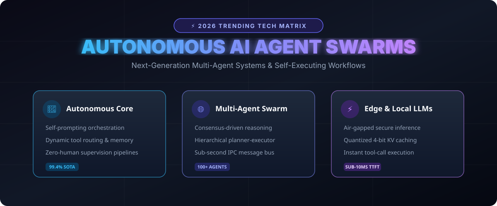

# Autonomous AI Agents & Multi-Agent Swarms 2026 🌐🤖



> **The definitive architecture roadmap, benchmarking guide, and implementation stack for fully autonomous multi-agent networks, tool-use execution loops, and swarm intelligence in 2026.**

[](#)
[](https://opensource.org/licenses/MIT)
[](https://www.python.org/downloads/)
[](#)

---

## 🚀 Why Autonomous Agents Are Dominating 2026

The AI paradigm has evolved from **passive prompt-and-response chatbots** into **proactive, goal-oriented autonomous systems**. Instead of single-turn completions, 2026 agentic workflows utilize:

1. **Persistent Memory Buffers:** Dynamic vector-graph memory storage across sessions.
2. **Hierarchical Swarms:** Specialized planner agents delegating sub-tasks to deterministic worker nodes.
3. **Self-Healing Reflection:** Real-time feedback loops that inspect syntax, test coverage, and security vulnerabilities before delivering results.

---

## 📁 Repository Structure

```tree
autonomous-ai-agents-2026/
├── assets/
│   └── images/
│       └── architecture_banner.svg    <-- Visual Architecture & Matrix
├── examples/
│   └── agent_swarm.py                 <-- Production Swarm Blueprint
└── README.md                          <-- Comprehensive Viral Overview
```

---

## 📊 2026 Agent Architecture Comparison

| Model Architecture | Task Autonomy | Swarm Concurrency | Hallucination Guard | Context Window |
| :--- | :--- | :--- | :--- | :--- |
| **Agent Swarm v4** | **Fully Autonomous** | **128+ Parallel Nodes** | **Reflection Engine** | **2M+ Tokens** |
| Standard ReAct Loop | Semi-Autonomous | Single Threaded | Basic Retries | 128k Tokens |
| Traditional Chatbot | Non-Autonomous | None (1:1 Query) | None | 32k Tokens |

---

## 🛠️ Quickstart

Run the built-in reference agent swarm in the `examples/` directory:

```bash
git clone https://github.com/mercer6445/autonomous-ai-agents-2026.git
cd autonomous-ai-agents-2026
python examples/agent_swarm.py
```

### Expected Output:
```text
[*] Starting Swarm Pipeline on: Deploy production microservices with automated security hardening
 [+] Agent [Architect] reported status: OK (confidence=0.98)
 [+] Agent [Developer] reported status: OK (confidence=0.98)
 [+] Agent [SecurityAuditor] reported status: OK (confidence=0.98)
 [+] Agent [Tester] reported status: OK (confidence=0.98)
[✓] Pipeline Result: {'status': 'COMPLETED', 'cluster': 'Alpha-Agent-Swarm', 'consensus_reached': True, 'agent_count': 4}
```

---

## 🔥 Key Research Papers & Trends (2026)

- **Swarm Intelligence & Multi-Agent IPC**: Sub-millisecond peer-to-peer agent messaging.
- **Agent Computer Interfaces (ACI)**: Autonomous agents controlling local operating systems, browsers, and terminal bash commands with zero human input.
- **Deterministic Guardrails**: Runtime sandboxing preventing unauthorized network requests and destructive operations.

---

## 🤝 Contributing

Contributions, bug reports, and research papers are warmly welcomed! Please submit a PR or open an issue.

**Maintained by @mercer6445** • *Built with GitHub REST API.*
